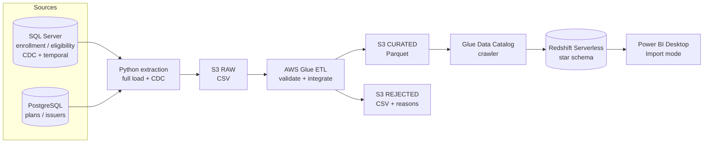

# Marketplace Enrollment Data Platform

I built a scaled-down, enterprise-style Marketplace (FFM-style) enrollment data platform using **entirely synthetic data**. No real people, PHI, PII, or employer/CMS information is used anywhere.

## Business Problem

A health insurance Marketplace receives operational enrollment and eligibility data in **Microsoft SQL Server**, while plan and issuer reference data lives in a separate **PostgreSQL** system. Analytics teams need reliable reporting across plans, issuers, states, premiums, and enrollment status.

The platform tracks operational changes, preserves history, integrates both systems, validates data quality, preserves raw source data, converts accepted data to analytics-optimized formats, loads an analytical warehouse, and exposes metrics in BI tools.

## Architecture

Infrastructure: **Terraform**. Monitoring: **CloudWatch** (Glue logs). Source control: **GitHub**.

## Results (end-to-end reconciliation)

| Stage | Count |
|---|---|
| Rows extracted to S3 raw (10 files, per manifest) | 8,178 |
| Enrollments entering Glue (SQL Server 3,001 + external feed 175) | 3,176 |
| Accepted → curated Parquet | 3,101 |
| Rejected → quarantine with reasons | 75 |
| Data quality pass rate | 97.64% |
| Rows in Redshift `fact_enrollment` | **3,101** (matches accepted) |

The Glue job enforces `extracted = accepted + rejected` and fails if it doesn't balance.

## Technology Stack

| Layer | Technology | Why |
|---|---|---|
| Operational source (OLTP) | SQL Server 2025 | T-SQL, CDC, temporal tables, indexing |
| Reference source | PostgreSQL 17 (Docker) | Separate system of record for plans/issuers |
| Extraction | Python (pyodbc, psycopg2, boto3) | Batch + CDC extraction to S3 |
| Data lake | Amazon S3 | Raw / curated / rejected zones |
| ETL + data quality | AWS Glue 5.0 (PySpark) | Validation, integration, Parquet output |
| Metadata | Glue Data Catalog + crawler | Schema discovery for downstream queries |
| Warehouse (OLAP) | Redshift Serverless | Star schema for analytics |
| BI | Power BI Desktop | Dashboard on Redshift (Import mode, DAX) |
| Infrastructure as Code | Terraform | Repeatable, reviewable AWS setup |

## Source Systems

### SQL Server (enrollment system of record)
Tables `applications`, `members`, `eligibility`, `enrollments`, with primary keys, foreign keys, CHECK constraints, and `DECIMAL(10,2)` for money.

- **CDC** on `enrollments`: captured INSERT / UPDATE / DELETE from the transaction log, compared all-changes vs net-changes, and extracted changes with an **LSN checkpoint**.
- **Temporal table** on `eligibility`: PENDING → ELIGIBLE, then `FOR SYSTEM_TIME AS OF` returns the prior state.
- **Indexing**: execution plan changed from *Clustered Index Scan* to *Index Seek* after adding a covering nonclustered index.
- **T-SQL**: joins, GROUP BY/HAVING, CASE, CTEs, transactions with rollback.

**CDC vs watermark:** a timestamp watermark (`updated_at > last_run`) misses deletes and intermediate states. CDC reads every committed change from the log.

### PostgreSQL (plan / issuer reference system)
Tables `issuers`, `plans`, `plan_rates`, `service_areas`. `plan_id` is the **cross-system identifier**, which can't be enforced by a foreign key across databases, so the pipeline validates it.

## Data Lake (S3)

| Zone | Contents | Format |
|---|---|---|
| `raw/` | Exactly what each source sent (+ manifest for lineage) | CSV |
| `curated/` | Validated, typed, integrated data | Parquet |
| `rejected/` | Bad rows with `rejection_reason`, `source_system`, `source_file`, `ingestion_timestamp` | CSV |

## Data Quality Rules (AWS Glue)

| Rule | Rejected |
|---|---|
| MISSING_REQUIRED_FIELD | 15 |
| INVALID_MEMBER_ID | 10 |
| INVALID_PLAN_ID | 10 |
| NEGATIVE_PREMIUM | 10 |
| INVALID_STATUS | 10 |
| INVALID_DATE_RANGE | 10 |
| DUPLICATE_ENROLLMENT | 10 |

Bad records arrive through a simulated **external partner feed**. Source-database constraints were never weakened.

## Warehouse (Redshift Serverless)

**Grain of `fact_enrollment`:** one row = one enrollment for one member in one plan for its coverage period.

Star schema: `fact_enrollment` → `dim_member`, `dim_plan`, `dim_issuer` (surrogate keys), plus `dq_summary` and `dq_rejections_by_reason`. Loaded with set-based `INSERT ... SELECT` via **Redshift Spectrum** over the Glue Data Catalog, and **`COPY ... FORMAT AS PARQUET`** for the DQ tables.

## Power BI Dashboard

Power BI Desktop connects **directly to Redshift** in Import mode, with one-to-many relationships from each dimension to the fact table. DAX measures: Total Enrollments, Active Enrollments, Average Monthly Premium, Data Quality Pass Rate.

## Security

- MFA on the root account; a separate non-root IAM user for CLI work
- No secrets in Git: `.env` is gitignored; the Redshift password lives in **AWS Secrets Manager**
- Least-privilege Glue role: read `raw/`, write only `curated/`, `rejected/`, `glue-temp/`
- S3 Block Public Access + server-side encryption
- Redshift reachable on port 5439 **only from one IP (/32)**, never `0.0.0.0/0`; SSL connections
- 100% synthetic data

## Cost Controls

Glue capped at 2 workers with a 15-minute timeout; Redshift capped at 8 RPU; all AWS resources removed with `terraform destroy` after the demo.

## Lessons Learned

- **First Glue run failed (S3 AccessDenied):** Spark writes `<folder>_$folder$` marker objects outside the allowed prefix. I granted access to only those markers instead of broadening the role, then reran safely (idempotent overwrites).
- **Terraform drift:** Spark's overwrite deleted folder markers Terraform created; `terraform plan` detected and restored them.
- **New Redshift endpoint:** the first connection timed out while the public endpoint finished attaching; verified with `Test-NetConnection` before retrying.

## Enterprise Scaling Considerations

- **Ingestion:** AWS DMS or Kafka/Kinesis instead of Python batch extraction
- **Orchestration:** Step Functions or Airflow (MWAA) with retries and alerts
- **Environments:** separate dev/test/prod accounts, remote Terraform state, CI/CD
- **Governance:** IAM Identity Center (SSO), Lake Formation, partitioning at scale

## Not Implemented

Amazon Quick (QuickSight), Athena query layer, scheduled orchestration, CI/CD.
